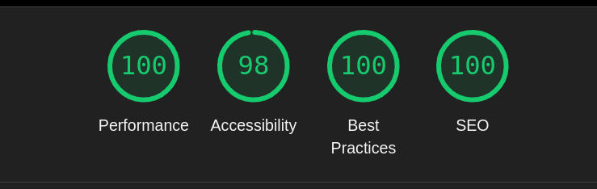
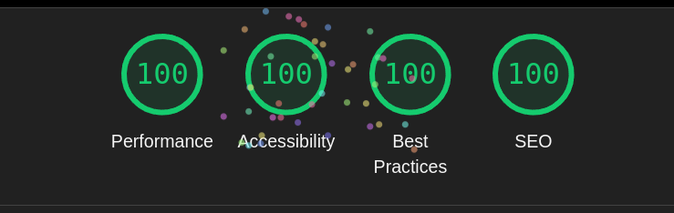

# 📌 Comenzando

1. Clona el proyecto desde el repositorio oficial:

```bash
git clone https://github.com/uSources/Telefonos
```

2. Instala las dependencias utilizando el siguiente comando.

```bash
npm install
```

3. Para iniciar el servidor de desarrollo, ejecuta uno de los siguientes comandos:

```bash
npm run dev
# or
yarn dev
# or
pnpm dev
# or
bun dev
```

Luego, abre [http://localhost:3000](http://localhost:3000) en tu navegador para ver el resultado.

---

# 🚀 Stack Tecnológico

Este proyecto ha sido desarrollado con las últimas versiones estables de **React 19** y **Next.js 15**, aprovechando características clave como minificación automática y optimización de imágenes.

Además, se han utilizado las siguientes librerías para mejorar la experiencia de desarrollo:

- **Shadcn** → Construcción de componentes UI.
- **Sonner** → Gestión de notificaciones tipo toast.
- **uuid** → Generación de identificadores únicos.
- **Tailwind CSS 4** → Estilos y diseño responsivo.

---

# 🎨 Sistema de Diseño

El sistema de diseño está implementado con **ShadCN**, utilizando **Tailwind CSS 4** y variables CSS para facilitar la personalización del tema.

---

# 🏗️ Arquitectura

El proyecto hace un uso intensivo de **React Server Components (RSC)**. Todas las llamadas a la API se realizan desde el servidor, protegiendo tanto la dirección del endpoint como el token de autenticación.

Para mejorar la experiencia del usuario, las respuestas de la API se **cachean por 1 hora** y pueden ser invalidadas mediante tags.

### **Estrategia de renderizado:**

✅ Todas las páginas se generan de forma estática, excepto el carrito de compras.  
✅ Se utiliza **ISR (Incremental Static Regeneration)** para renderizar dinámicamente los detalles de los productos.  
✅ Se usa el componente `Image` de Next.js para optimizar y cachear imágenes automáticamente.  
✅ Las etiquetas **meta** se generan dinámicamente en cada página para mejorar el **SEO** y la accesibilidad.

---

# 📂 Estructura de Carpetas

Se ha optado por una organización basada en **tipo y feature**, ya que el proyecto no es excesivamente grande.

Las principales carpetas incluyen:

- **components/** → Componentes reutilizables.
- **hooks/** → Hooks personalizados.
- **lib/** → Funciones auxiliares y utilidades.
- **services/** → Llamadas a la API.
- **types/** → Definiciones de tipos y modelos.

Cada una de estas carpetas se desglosa por funcionalidad, como el carrito de compras, componentes comunes o la vista de detalle de un producto.

Si el proyecto creciera en tamaño, se podría considerar migrar a una **Screaming Architecture**, optimizando la organización para proyectos de mayor escala.

📖 Más información: [Ver documentación](https://dev.to/itswillt/folder-structures-in-react-projects-3dp8)

---

# 🚢 Despliegue en Vercel

El repositorio está conectado con **GitHub**, y cada cambio en la rama `main` se despliega automáticamente en **Vercel**.

🔗 **[Ver proyecto en producción](https://telefonos-rose.vercel.app/)**

---

# 🧪 Pruebas Automatizadas con Playwright

En la carpeta **/tests** encontramos una batería de tests e2e que se centran en las principales pantallas, como el listado de productos, el detalle del producto y el carrito de compra.

Se asume que estas pruebas se realizan en un entorno de pruebas donde los datos permanecen constantes, asegurando que no haya cambios en las respuestas del sistema durante su ejecución.

### 📌 Ejecutar pruebas localmente:

🔹 Con interfaz gráfica:

```bash
npm run e2e:ui
```

🔹 Modo sin interfaz (CI):

```bash
npm run e2e:ci
```

Las pruebas se ejecutan automáticamente en cada commit para garantizar la estabilidad del proyecto. Los resultados pueden consultarse en la sección **GitHub Actions**.

---

# 🧪 Testing con Jest

Encontramos también una batería de tests para los **hooks reutilizables**, tales como:

Se asume que estas pruebas se realizan en un entorno de pruebas donde los datos permanecen constantes, asegurando que no haya cambios en las respuestas del sistema durante su ejecución.

- `use-product-selection`
- `use-cart`

### 📌 Ejecutar pruebas localmente:

```bash
npm run test
```

Las pruebas se ejecutan automáticamente en cada commit para garantizar la estabilidad del proyecto. Los resultados pueden consultarse en la sección **GitHub Actions**.

---

# 🔮 Futuras Mejoras

- 🛒 **Filtros y ordenación** en el listado de productos.
- 💾 Guardar el **carrito en el servidor**, asociado a cada usuario, para que se pueda recuperar desde cualquier dispositivo.
- 🚀 Implementación de **upselling en el carrito**.
- 📑 **Paginación** en la lista de productos.
- 🎨 Cambio de **color en el listado**.
- 🔧 Añadir más **tests unitarios** al resto de componentes.
- 🖼️ Implementar **tests de regresión visual** a los componentes UI.

---

# 📊 Resultados en Lighthouse

Se han realizado pruebas de rendimiento, accesibilidad y buenas prácticas con **Lighthouse** en las principales secciones del proyecto. A continuación, se muestran los resultados obtenidos:

### 📍 Listado de productos


### 🛍️ Detalle de producto



### 🛒 Carrito de compras



Estos resultados garantizan un **buen rendimiento**, **accesibilidad óptima** y **mejores prácticas de desarrollo** en la aplicación.

---
