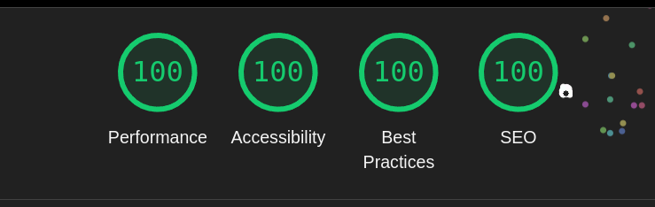

# 📌 Comenzando

Para iniciar el servidor de desarrollo, ejecuta uno de los siguientes comandos:

```bash
npm run dev
# or
yarn dev
# or
pnpm dev
# or
bun dev
```

Luego, abre [http://localhost:3000](http://localhost:3000) en tu navegador para ver el resultado.

---

# 🚀 Stack Tecnológico

Este proyecto ha sido desarrollado con las últimas versiones estables de **React 19** y **Next.js 15**, aprovechando características clave como minificación automática y optimización de imágenes.

Además, se han utilizado las siguientes librerías para mejorar la experiencia de desarrollo:

- **Shadcn** → Construcción de componentes UI.
- **Sonner** → Gestión de notificaciones tipo toast.
- **uuid** → Generación de identificadores únicos.
- **Tailwind CSS 4** → Estilos y diseño responsivo.

---

# 🎨 Sistema de Diseño

El sistema de diseño está implementado con **ShadCN**, utilizando **Tailwind CSS 4** y variables CSS para facilitar la personalización del tema.

---

# 🏗️ Arquitectura

El proyecto hace un uso intensivo de **React Server Components (RSC)**. Todas las llamadas a la API se realizan desde el servidor, protegiendo tanto la dirección del endpoint como el token de autenticación.

Para mejorar la experiencia del usuario, las respuestas de la API se **cachean por 1 hora** y pueden ser invalidadas mediante tags.

### **Estrategia de renderizado:**

✅ Todas las páginas se generan de forma estática, excepto el carrito de compras.  
✅ Se utiliza **ISR (Incremental Static Regeneration)** para renderizar dinámicamente los detalles de los productos.  
✅ Se usa el componente `Image` de Next.js para optimizar y cachear imágenes automáticamente.  
✅ Las etiquetas **meta** se generan dinámicamente en cada página para mejorar el **SEO** y la accesibilidad.

---

# 📂 Estructura de Carpetas

Se ha optado por una organización basada en **tipo y feature**, ya que el proyecto no es excesivamente grande.

Las principales carpetas incluyen:

- **components/** → Componentes reutilizables.
- **hooks/** → Hooks personalizados.
- **lib/** → Funciones auxiliares y utilidades.
- **services/** → Llamadas a la API.
- **types/** → Definiciones de tipos y modelos.

Cada una de estas carpetas se desglosa por funcionalidad, como el carrito de compras, componentes comunes o la vista de detalle de un producto.

Si el proyecto creciera en tamaño, se podría considerar migrar a una **Screaming Architecture**, optimizando la organización para proyectos de mayor escala.

📖 Más información: [Ver documentación](https://dev.to/itswillt/folder-structures-in-react-projects-3dp8)

---

# 🚢 Despliegue en Vercel

El repositorio está conectado con **GitHub**, y cada cambio en la rama `main` se despliega automáticamente en **Vercel**.

🔗 **[Ver proyecto en producción](https://telefonos-rose.vercel.app/)**

---

# 🧪 Pruebas Automatizadas con Playwright

Este proyecto incluye pruebas de integración continua con **Playwright**.

### 📌 Ejecutar pruebas localmente:

🔹 Con interfaz gráfica:

```bash
npm run e2e:ui
```

🔹 Modo sin interfaz (CI):

```bash
npm run e2e:ci
```

Las pruebas se ejecutan automáticamente en cada commit para garantizar la estabilidad del proyecto. Los resultados pueden consultarse en la sección **GitHub Actions**.

---

# 🔮 Futuras Mejoras

- 🛒 **Filtros y ordenación** en el listado de productos.
- 💾 Guardar el **carrito en el servidor**, asociado a cada usuario, para que se pueda recuperar desde cualquier dispositivo.
- 🚀 Implementación de **upselling en el carrito**.
- 📑 **Paginación** en la lista de productos.
- 🎨 Cambio de **color en el listado**.

---

He mejorado la redacción y formato del apartado de **Lighthouse** para que sea más claro y fluido:

---

# 📊 Resultados en Lighthouse

Se han realizado pruebas de rendimiento, accesibilidad y buenas prácticas con **Lighthouse** en las principales secciones del proyecto. A continuación, se muestran los resultados obtenidos:

### 📍 Listado de productos



### 🛍️ Detalle de producto


### 🛒 Carrito de compras


Estos resultados garantizan un **buen rendimiento**, **accesibilidad óptima** y **mejores prácticas de desarrollo** en la aplicación.

---
